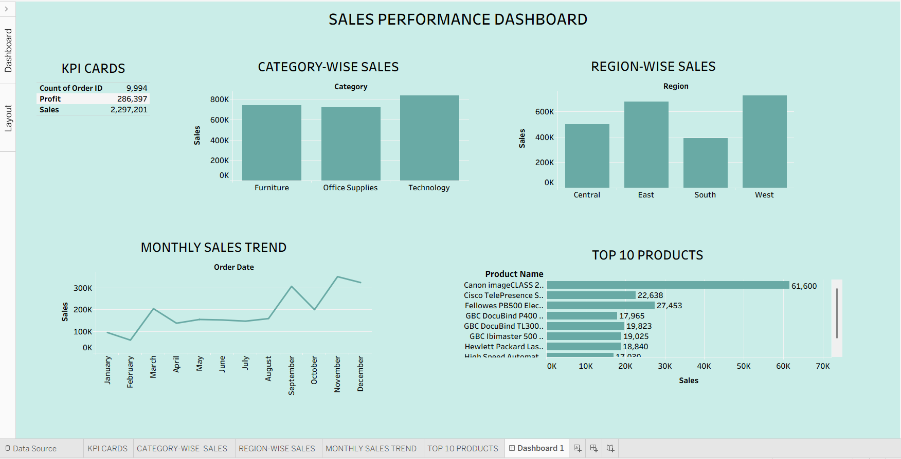

📊 Sales Performance Dashboard in Tableau
📌 Project Overview

This project presents an interactive Sales Performance Dashboard built using Tableau. It analyzes sales data from the Superstore dataset to uncover key business insights related to revenue, profit, and order trends.

🎯 Objectives
Analyze overall sales and profit performance
Identify top-performing categories and products
Track sales trends over time
Enable interactive filtering for better decision-making
📂 Dataset
Dataset Used: Superstore Dataset
Contains information on orders, sales, profit, category, region, and shipping details
📊 Dashboard Features
💰 Total Sales KPI
📈 Total Profit KPI
📦 Total Orders KPI
📊 Category-wise Sales Analysis
🌍 Region-wise Sales Analysis
📈 Monthly Sales Trend
🏆 Top 10 Products by Sales
🎛️ Interactive Filters (Region, Category)
⚙️ Tools & Technologies
Tableau
Data Visualization
Data Analysis
🧠 Key Insights
Identified high-performing product categories
Analyzed regional sales distribution
Observed monthly trends and seasonal patterns
Highlighted top revenue-generating products
🧮 Calculated Field

Order Duration (in days):

DATEDIFF('day', [Order Date], [Ship Date])
🚀 How to Use
Download the dataset
Open Tableau
Load the dataset
Open the dashboard file (.twb / .twbx)
Use filters to explore insights
📸 Dashboard Preview

💡 Future Improvements
Add profit ratio analysis
Include discount impact insights
Enhance UI with advanced formatting
🙌 Author

Chinmaya Sajeevan
Aspiring AI/ML Engineer | Data Enthusiast

⭐ If you like this project

Give it a ⭐ on GitHub and feel free to connect!
